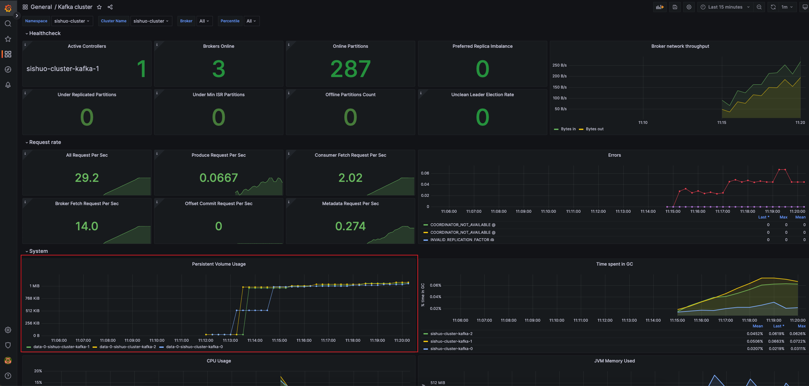
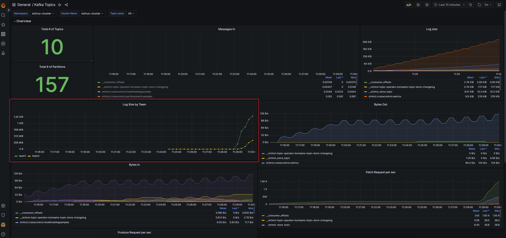

# Introduction

This repository contains the following Strimzi examples
* Monitoring using Prometheus & Grafan with sample `Kafka Cluster` dashboard ported for K8s environment.
* Kafka Cruise Control
  * Scaling brokers up and down
  * Rebalance uneven disk usage among brokers
* Multi-Tennancy monitoring: group and view topic metrics (e.g. log size) at tenant level 

# Getting Started

## Create EKS Cluster
1. Review `/assets/deployments/00-default-cluster.yaml` and update `KeyPair`, `instanceType` etc.
2. Run `02-create-eks-cluster.sh` to provision EKS in AWS.

## Deplooy Kafka and Prometheus
1. Run `01-kafka-cluster.sh` to deploy Kafka, Prometheus and Grafana.
2. After the deployment is done, run the below command to access P/G using local ports.
    ```bash
    nohup kubectl port-forward svc/grafana 3000:3000 &>/dev/null &
    nohup kubectl port-forward svc/prometheus-operated 9090:9090 &>/dev/null &
    ```
3. Launch Grafana at http://localhost:3000 (admin/admin) and add the Prometheus datasource: `http://prometheus-operated:9090` and import dashboard from `assets/dashboard`
4. Cluster bootstrap endpoint: `kubectl get services` to get loadbalancer endpoint.


## Scale Up Kafka

### Prerequisites
Make sure cruise control is added to your Kafka cluster.
```yaml
apiVersion: kafka.strimzi.io/v1beta1
kind: Kafka
metadata:
  name: my-cluster
spec:
  # ...
  cruiseControl: {}
```

In this exercise we scale the cluster from 3 pod to 4 pod. Each pod use a dedicated worker node. So we also need to scale worker nodes from 3 to 4.

1. Create a `test` topic and produce some data.
2. Create one more node
    ```bash
    eksctl scale nodegroup --cluster=sishuo-eks --nodes=4 --name=kafka-workers
    ```
3. Deploy one more replica by changing the `replicas` from 3 to 4 in `./assets/deployments/00-kafka.yml/00-kafka.yml`.
    ```bash
    kubectl apply -f ../deployments/00-kafka.yml
    ```
4. Run `kubectl get pods` to check the new pod is created.

    If the Grafana dashboard still shows 3 brokers, go to dashboard setting -> variable -> `kafka_broker` -> `run query`.
5. Rebalance the Cluster. To move the partition replicas to the new broker, we use `Strimzi Cruise Control `to Rebalance the cluster.
    ```bash
    kubectl apply -f ./assets/operation-guide/00-add-brokers.yaml

    # describe the rebalance status
    k describe kafkarebalance my-rebalance

    Optimization Result:
        After Before Load Config Map:  my-rebalance
        Data To Move MB:               46
        Excluded Brokers For Leadership:
        Excluded Brokers For Replica Move:
        Excluded Topics:
        Intra Broker Data To Move MB:         0
        Monitored Partitions Percentage:      100
        Num Intra Broker Replica Movements:   0
        Num Leader Movements:                 16
        Num Replica Movements:                80
        On Demand Balancedness Score After:   80.87946050436929
        On Demand Balancedness Score Before:  76.41773549482696
        Provision Recommendation:             
        Provision Status:                     RIGHT_SIZED
        Recent Windows:                       1
    ```
6. Once the proposal is ready, use the below command to approve
    ```bash
    kubectl annotate kafkarebalance my-rebalance strimzi.io/rebalance=approve
    ```
7. Now monitor the rebalancing status
    ```
    k get kafkarebalance my-rebalance            
    NAME           CLUSTER          PENDINGPROPOSAL   PROPOSALREADY   REBALANCING   READY   NOTREADY
    my-rebalance   sishuo-cluster                                                   True    
    ```
8. Describe the existing `test` topic and verify the replicas are moved to the new brokers.

## Scale Down
In this exercise, we scale down the Kafka cluster.

1. Create a test topic and produce data to it.
    ```
    kafka-topics --bootstrap-server $BS --create --topic test --partitions 9
    kafka-topics --bootstrap-server $BS --describe --topic test
    kafka-producer-perf-test --producer-props bootstrap.servers=$BS --throughput 10 --topic test --num-records 10000000 --record-size 1000
    ```
2. Describe the topic and note the follower brokers.
3. Run the scale down command.
    ```bash
    # generate proposal
    kubectl apply -f ./assets/operation-guide/01-remove-brokers.yaml
    # perform rebalance
    kubectl annotate kafkarebalance remove-broker-rebalance strimzi.io/rebalance=approve
    #check status
    kubectl get kafkarebalance
    ```

4. Producer should only sees transient errors.
5. After the rebalance is finished, the partitions of `test` topic are all moved to the first 3 brokers.
6. Scale down the pod now. Change the `00-kafka.yml` replicas from `4` to `3`. Run `kubectl get pods` to verify `kafka-3` node is removed.
    ```bash
    # scale down the pods
    kubectl apply -f deployments/00-kafka.yml
    ```
7. Scale down nodes: `eksctl scale nodegroup --cluster=sishuo-eks --nodes=3 --name=kafka-workers`

## Uneven load
In this excersise we simulate a Kafka cluster with uneven data storage and rebalance it using Cruise Control.

1. Scale nodes first.
    ```bash
    eksctl scale nodegroup --cluster=sishuo-eks --nodes=8 --name=kafka-workers
    ```

2. Create some test topics
    ```bash
    kafka-topics --bootstrap-server $BS --create --topic test-p1-r1 --partitions 1 --replication-factor 1
    kafka-topics --bootstrap-server $BS --create --topic test-p1-r3 --partitions 1 --replication-factor 3
    kafka-topics --bootstrap-server $BS --create --topic test-p3-r3 --partitions 3 --replication-factor 3
    kafka-topics --bootstrap-server $BS --create --topic test-p12-r3 --partitions 12 --replication-factor 3
    kafka-topics --bootstrap-server $BS --create --topic test-p6-r3 --partitions 6 --replication-factor 1
    ```
3. Run Python script to produce data unevenly to these topics.
    ```bash
        # change the bootstrap server in the python file first.
        python3 ./02-unbalanced-producer.py
    ```
4. Wait for 30 minutes to generate unbalanced load. You can view the PV usage using the kafka-cluster dashboard.

1. Rebalance cluster
    ```bash
    ## apply rebalance custom resource
    kubectl apply -f ./assets/operation-guide/02-balance-disk.yaml
    ## approve the proposal
    kubectl annotate kafkarebalance my-disk-rebalance strimzi.io/rebalance=approve
    ```

## Failure Scenario
### Pod Failure
* 1 pod failure, RF=1 topics will not be available until the new pod is scheduled. RF=3 topics are not impacted.
* 2 pods failure. `min.insync.replica=2` topics will not be available.

### Node Failure
#### 1 node failure
Simulation Steps
* Terminate 1 node in EC2 console.
* `k get nodes` shows the terminated node is `NotReady,SchedulingDisabled`
* The producer sees some transient errors and recovered after a few seconds.
* The pod running on the terminated node is not serving any request. This is equivalent to a broker failure.
* `kafka-topics` shows the partiton 2 is offline. `URP` number is non-zero.

#### Recover from 1 node failure
* Node is re-created by EKS

#### 2 node failure
Simulation steps
* Terminate 2 EC2 instances
* Producer sees `NOT_ENOUGH_REPLICAS` error
* `k get nodes` shows the terminated node is `NotReady,SchedulingDisabled`
* Pods will be re-created after a while

## Change Replication Factor
Edit `05-topics-to-move.json` to specify the brokers for the additional replicas.
```bash
kafka-reassign-partitions --bootstrap-server $BS --reassignment-json-file ./assets/operation-guide/05-topics-to-move.json --execute
```
After a while, we should see the PV usage on impacted pods are changed.

## Kafka Version upgrade
Strimzi does the rolling update automatically. There is no impact on clients if the topics are configured with correct RF.
1. Verif the Strimzi supported Kafka version here. https://strimzi.io/downloads/
2. Upgrade the Strimzi operator first if necessary
3. Update Kafka version in the resource file and run `k apply -f ./assets/deployments/00-kafka.yml`
4. Verify broker version:
    ```bash
    k logs sishuo-cluster-kafka-5 | grep version
    2023-03-27 07:12:30,999 INFO Kafka version: 3.4.0 (org.apache.kafka.common.utils.AppInfoParser) [main]
    ```

## Multi-Tenancy
### ACL and Quota
1. Create topic, users and ACLs.
    ```bash
    k apply -f operation-guide/06-topic.yaml
    k apply -f operation-guide/06-user.yaml
    ```
2. Run `03-get-client-properties.sh` to generate client properties.
3. Run producer to test the quota.
    ```bash
    # non-throttled user
    kafka-producer-perf-test --producer-props bootstrap.servers=$BS --throughput -1 --topic team1.topic1 --num-records 1000000 --record-size 1000 --producer.config ./clients/team1-user1.properties

    # throttled user
    kafka-producer-perf-test --producer-props bootstrap.servers=$BS --throughput -1 --topic team2.topic1 --num-records 500000 --record-size 1000 --producer.config ./clients/team2-user1.properties
    ```
4. Change to other topics and expect to see ACL authorization error.

### Tenant/Team Monitoring
The `kafka-topics` dashobard in `./assets/dashboard` folder provides a team/tenant level topic monitoring example. It groups team topics using an extra Prometheus data label.


1. Team/tenant monitoring assumes the tenant topics follow the `teamX.xxxx` naming convention, for example `team1.topic1` The naming convention can be changed via the Kafka exporter rules. These rules are defined as `ConfigMap` in `00-kafka.yml`.

    ```yaml
        # "kafka.cluster:type=*, name=*, topic=*, partition=*"
        # "kafka.log:type=*,name=*, topic=*, partition=*"
        # Matches all other none tenant topics. e.g. internal topics, shared topics
        - pattern: kafka.(\w+)<type=(.+), name=(.+), topic=((?!team).*), partition=(.+)><>Value
            name: kafka_$1_$2_$3
            type: GAUGE
            labels:
            topic: "$4"
            partition: "$5"
        # Matches team/tenant topics.
        - pattern: kafka.(\w+)<type=(.+), name=(.+), topic=(team.+)\.(.+), partition=(.+)><>Value
            name: kafka_$1_$2_$3_by_tenant
            type: GAUGE
            labels:
            topic: "$4.$5" 
            team: "$4" # extra data label to indicate the tenant/owner of the topic
            partition: "$6"
    ```
2. Grafana dashboard automatically aggregate topic log size for different teams, as shown in the above picture.
